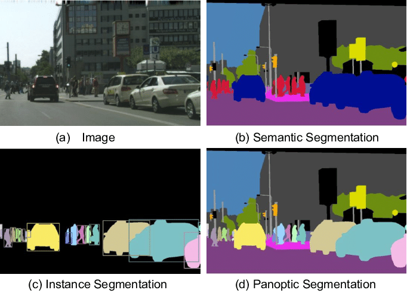

# Cloud Computing - Servan PELLÉ

Mise en place d'un CNN de segmentation dans Amazon AWS

# Contenu

1. [C'est quoi la segmentation d'Image](#cest-quoi-la-segmentation-dimage)
2. [Choix d'un CNN](#choix-dun-cnn)
3. [Préparation du Modèle](#préparation-du-modèle)
4. [Construction du Modèle](#construction-du-modèle)
5. [Fonction d'Appel du Modèle](#fonction-dappel-du-modèle)
6. [Création d'un Serveur Flask](#création-dun-serveur-flask)
7. [Déploiment du Service sur une Instance AWS EC2](#déploiment-du-service-sur-une-instance-aws-ec2)
8. [Déploiment & Adaptation de notre Serveur Flask](#d2ploiment--adaptation-de-notre-serveur-flask)
9. [Lancement & Exploitation de notre Service](#lancement--exploitation-de-notre-service)
10. [Conclusion](#conclusion)

# C'est quoi la segmentation d'Image ?

> L'objectif principal de ce projet est de déployer un service de segmentation d'images sur Amazon AWS.

> "La segmentation d'image est une opération de traitement d'images consistant à détecter et rassembler les pixels suivant des critères, notamment d'intensité ou spatiaux, l'image apparaissant ainsi formée de régions uniformes. La segmentation peut par exemple montrer les objets en les distinguant du fond avec netteté. Dans les cas où les critères divisent les pixels en deux ensembles, le traitement est une binarisation." (Wikipedia, s.d.)



# Choix d'un CNN

> Pour effectuer le traitement d'images, nous envisageons d'utiliser un modèle CNN (Convolutional Neural Network) qui est déjà entraîné. Cela signifie que le modèle a déjà été exposé à une grande quantité de données et a appris à extraire des caractéristiques pertinentes des images. En utilisant un modèle pré-entraîné, nous pouvons bénéficier de cette expertise sans avoir besoin de passer par le processus intensif d'entraînement du modèle à partir de zéro.
> 
> Dans notre démarche, nous cherchons un modèle qui soit à la fois performant et facile à intégrer dans notre environnement. Nous privilégions donc un modèle qui offre un bon équilibre entre précision et complexité, tout en étant adapté à notre cas d'utilisation spécifique.
> 
> Pour cette raison, nous avons choisi d'explorer les modèles disponibles en Python, en particulier ceux fournis par la bibliothèque PyTorch. PyTorch est une bibliothèque d'apprentissage automatique largement utilisée qui offre une grande flexibilité et une facilité d'utilisation. De plus, PyTorch propose une gamme de modèles pré-entraînés qui sont prêts à être utilisés pour diverses tâches, y compris la segmentation d'images.
> 
> Le choix d'un modèle pré-entraîné disponible en Python et spécifiquement dans PyTorch nous offre plusieurs avantages. Tout d'abord, cela nous permet de gagner du temps en évitant de devoir entraîner un modèle à partir de zéro. Ensuite, cela nous garantit une certaine qualité et fiabilité dans les performances du modèle, étant donné qu'il a été préalablement testé et évalué par la communauté. De plus, l'intégration avec PyTorch facilite le déploiement du modèle dans notre environnement AWS, grâce aux outils et fonctionnalités disponibles dans cette bibliothèque.
> 
> Nous nous baserons sur un exemple d'exploitation présenté dans ce repo git : [Mask R-CNN Instance Segmentation with PyTorch](./README.md)

> Ce notebook propose une solution comprenant une fonction `instance_segmentation_api`, nous permettant d'obtenir facilement une image segmentée.


> En réalité, cette fonction offre une double fonctionnalité : la __segmentation__ et la __classification__. Comme illustré précédemment, elle génère une image de sortie où certains éléments sont mis en évidence, ce qui correspond à la __segmentation__. En plus de cela, elle encadre chaque élément avec une étiquette associée, ce qui constitue la __classification__.

La __segmentation__ consiste à diviser une image en régions distinctes pour identifier les différents objets ou éléments présents. Dans notre cas, cette fonction nous permet de visualiser ces régions mises en évidence sur l'image de sortie, facilitant ainsi l'identification des différents éléments présents dans l'image.

D'autre part, la __classification__ implique d'attribuer une étiquette ou un label à chaque objet identifié. Cette fonction va au-delà de la simple segmentation en ajoutant des encadrés autour de chaque région segmentée et en fournissant un label associé à chacune d'elles. Cela permet une identification plus précise des objets détectés dans l'image.

> De manière plus précise cette fonction permet de mettre en place un R-CNN :
>
> "R-CNN commence par diviser l’image d’entrée en plusieurs régions potentielles. Les caractéristiques où un objet peut être localisé sont déterminées au moyen de méthodes telles que le selective search (recherche sélective). Ce selective search fonctionne en fusionnant ou en divisant des segments de l’image selon divers indices : couleur, forme, texture…
>
> __Extraction de caractéristiques__
>
> Une fois ces propositions de régions générées, quelques 2 000 régions sont extraites et déformées à une taille cohérente. Chacune de ces régions est ensuite donnée en entrée à un modèle CNN, qui va tâcher d’en extraire des caractéristiques précises." (datascientest.com)
>
> __Classification des objets__
>
> Les vecteurs de caractéristiques issus des propositions de régions sont alimentés dans un classificateur d’apprentissage automatique visant à déterminer si la proposition de région contient ou non une instance d’une classe prédéfinie."
>
> (datascientest.com, s.d.)

# Préparation du Modèle

> Dans l'état actuel, l'utilisation du modèle n'est pas possible. Une observation attentive du code révèle qu'il télécharge un modèle pré-entraîné, ce qui prend du temps. Pour éviter cette attente, nous allons exporter les poids du modèle dans un fichier dédié avec l'extension `.pth`. En faisant cela, nous pourrons reconstruire le modèle sans avoir besoin de télécharger à nouveau les poids, tout en préservant sa précision.
> 
> Cette approche offre plusieurs avantages. Tout d'abord, elle réduit considérablement le temps nécessaire pour utiliser le modèle, car nous n'aurons plus besoin de télécharger les poids à chaque utilisation. Cela améliore considérablement l'efficacité et la rapidité du processus.
>
> De plus, en exportant les poids du modèle dans un fichier distinct, nous assurons la portabilité du modèle. Nous pouvons facilement transférer ce fichier sur d'autres machines ou plateformes sans avoir à télécharger à nouveau les poids du modèle.
>
> Enfin, cette méthode garantit la cohérence des résultats, car les poids du modèle sont préservés exactement tels qu'ils étaient au moment de l'exportation. Ainsi, nous pouvons reconstruire le modèle avec précision, en conservant ses performances initiales.

> Dans un deuxième temps, nous allons créer un fichier avec l'extension `.py` où nous reconstruirons notre modèle et adapterons les fonctions nécessaires pour son utilisation. Cette approche nous permettra de modulariser notre code, ce qui le rendra plus propre, plus facile à maintenir et à réutiliser.
>
> En déplaçant la logique de construction du modèle dans un fichier `.py`, nous séparons clairement les préoccupations, ce qui rend le code plus organisé et modulaire. De plus, cela facilite la collaboration, car différentes parties du code peuvent être gérées par différentes personnes sans interférer les unes avec les autres.
>
> En adaptant les fonctions d'utilisation du modèle dans ce fichier `.py`, nous les rendons facilement accessibles depuis d'autres parties de notre projet. Cela signifie que nous pouvons importer ce fichier dans d'autres scripts ou notebooks et utiliser les fonctions sans avoir à répéter le code de construction du modèle à chaque fois.
>
> De plus, cette approche favorise la réutilisabilité du code. Une fois que nous avons créé et testé notre modèle dans le fichier `.py`, nous pouvons le réutiliser dans différents projets ou scénarios sans avoir à réécrire le code de construction du modèle à chaque fois.

### Construction du Modèle 

```python
# Récupération des poids du modèle pré-entrainé
MODEL_PATH = "model/maskrcnn_resnet50_fpn_coco.pth"
FULL_MODEL_PATH = os.path.join(current_path, MODEL_PATH)

# Récupération du modèle et application des poids
model = torchvision.models.detection.maskrcnn_resnet50_fpn(pretrained=True)
model.load_state_dict(torch.load(FULL_MODEL_PATH))
model.eval()
```

### Fonction d'Appel du Modèle 

```python
def instance_segmentation_api(img_path, out_path, threshold=0.5, rect_th=3, text_size=1, text_th=3):
    """
    instance_segmentation_api
    parameters:
      - img_path - path to input image
    method:
      - prediction is obtained by get_prediction
      - each mask is given random color
      - each mask is added to the image in the ration 1:0.8 with opencv
      - final output is displayed
    """

    full_img_path = os.path.join(current_path, img_path)
    
    masks, boxes, pred_cls = get_prediction(full_img_path, threshold)
    img = cv2.imread(full_img_path)
    img = cv2.cvtColor(img, cv2.COLOR_BGR2RGB)
    for i in range(len(masks)):
        rgb_mask = random_colour_masks(masks[i])
        img = cv2.addWeighted(img, 1, rgb_mask, 0.5, 0)
        pt1 = (int(boxes[i][0][0]), int(boxes[i][0][1]))  
        pt2 = (int(boxes[i][1][0]), int(boxes[i][1][1]))
        cv2.rectangle(img, pt1, pt2, color=(0, 255, 0), thickness=rect_th)
        cv2.putText(img, pred_cls[i], pt1, cv2.FONT_HERSHEY_SIMPLEX, text_size, (0,255,0), thickness=text_th)

    out_path = os.path.join(current_path, out_path)

    filename = os.path.basename(img_path)
    filename_without_extension = os.path.splitext(filename)[0]
    desired_string = filename_without_extension.split('.')[0]

    buffered = io.BytesIO()
    plt.imsave(f'{out_path}/segmented.png', img, format='PNG')
    img_str = base64.b64encode(buffered.getvalue()).decode()

    return img_str
``` 

> Cette fonction prend en argument le chemin d'une image en entrée et génère une image segmentée correspondante, qui sera ensuite stockée dans un répertoire spécifié du projet.
> 
> Cela signifie que lorsque nous appelons cette fonction en lui fournissant le chemin vers une image, elle va effectuer le processus de segmentation sur cette image et créer une nouvelle image où les éléments segmentés sont mis en évidence. Cette image résultante est ensuite enregistrée dans un répertoire déterminé dans notre projet, afin qu'elle puisse être consultée ou utilisée ultérieurement.
>
> L'avantage de cette approche est qu'elle permet une utilisation flexible de la fonction. En fournissant simplement le chemin de l'image d'entrée, nous pouvons obtenir rapidement une version segmentée de cette image, sans avoir à effectuer manuellement le processus de segmentation à chaque fois. De plus, en enregistrant l'image segmentée dans un répertoire spécifié du projet, nous assurons une organisation efficace des données résultantes, ce qui facilite leur gestion et leur accès ultérieur.

# Création d'un Serveur Flask

> Pour développer notre application, nous opterons pour la création d'un serveur web Flask. Ce serveur sera conçu pour gérer des requêtes API de type POST et GET. Ces requêtes permettront respectivement de fournir une image à segmenter et de récupérer l'image segmentée correspondante.
>
> Le choix de Flask s'explique par sa simplicité et sa flexibilité. En utilisant Flask, nous pouvons rapidement mettre en place un serveur web capable de répondre aux besoins spécifiques de notre application sans ajouter de complexité inutile.
>
> La mise en place de l'API POST nous permettra de recevoir les images à traiter. Les clients pourront envoyer leurs images au serveur, qui se chargera ensuite de les segmenter en utilisant les méthodes appropriées.
>
> D'autre part, l'API GET sera utilisée pour récupérer les images segmentées. Une fois l'image segmentée générée par le serveur, les clients pourront la récupérer en envoyant une requête GET appropriée.
>
> Cette approche basée sur des API RESTful offre une architecture simple et standard pour la communication entre le client et le serveur. Elle permet une intégration aisée avec d'autres systèmes et une évolutivité efficace de l'application.

```python
import os

from flask import Flask, render_template, request
from werkzeug.utils import secure_filename

from model.model import instance_segmentation_api


app = Flask(__name__)

app.config['UPLOAD_FOLDER'] = 'static'
app.config['MAX_CONTENT_PATH'] = 4000

@app.route('/')
def home():
   return render_template('index.html')

@app.route('/uploader', methods=['GET', 'POST'])
def upload_file():
    if request.method == 'POST':
        f = request.files['file']
        f.save(os.path.join(app.config['UPLOAD_FOLDER'], secure_filename('input_img.png')))
        instance_segmentation_api(img_path=os.path.join(app.config['UPLOAD_FOLDER'], 'input_img.png'), out_path=app.config['UPLOAD_FOLDER'])
        input_img_path = os.path.join(app.config['UPLOAD_FOLDER'], 'input_img.png')
        segmented_img_path = os.path.join(app.config['UPLOAD_FOLDER'], 'segmented.png')
        return render_template("index.html", input_img=input_img_path, segmented_img=segmented_img_path)
		
if __name__ == '__main__':
   app.run(debug = True)
```

> Pour rendre l'utilisation de ce service plus conviviale, nous avons développé une vue HTML qui offre une interface utilisateur intuitive. Cette vue comprend un formulaire interactif permettant aux utilisateurs de charger une image à partir de leur appareil et de l'envoyer au serveur pour obtenir une version segmentée de l'image.
>
> Le formulaire HTML est conçu de manière à guider les utilisateurs à travers le processus de chargement et de soumission de l'image. Il comporte un bouton de sélection de fichier qui permet aux utilisateurs de parcourir leur système de fichiers et de choisir l'image qu'ils souhaitent segmenter. Une fois l'image sélectionnée, l'utilisateur peut la soumettre en appuyant sur un bouton d'envoi.
>
> Lorsque l'utilisateur soumet l'image, le formulaire envoie une requête POST au serveur web Flask, qui déclenche alors le processus de segmentation de l'image. Une fois la segmentation terminée, le serveur renvoie une réponse contenant l'image segmentée, qui est ensuite affichée à l'utilisateur sur la page HTML.
>
> Cette interface utilisateur simplifiée permet aux utilisateurs de profiter du service de segmentation d'images sans avoir à manipuler directement du code ou à utiliser une interface de ligne de commande. En fournissant une expérience utilisateur plus conviviale, nous encourageons une adoption plus large du service et facilitons son utilisation par un public non technique.

```html
<html>
   <body>
      <form action = "{{ url_for('upload_file') }}" method = "POST" 
         enctype = "multipart/form-data">
         <input type = "file" name = "file" />
         <input type = "submit"/>
      </form>   
        
        
   </body>
</html>
```


# Déploiment du Service sur une Instance AWS EC2

> Maintenant que notre application est prête, nous allons la déployer sur une instance Amazon AWS EC2. Pour faciliter la gestion de notre projet et permettre une récupération aisée, nous allons d'abord créer un dépôt Git où nous stockerons notre code.
>
> Une fois notre code hébergé dans un dépôt Git, nous procéderons à la création d'une instance EC2. Cette instance EC2 sera configurée pour exécuter notre application et fournir les services de segmentation d'images via une API. Pour assurer un accès facile à notre service, nous attribuerons une adresse IP élastique (Elastic IP) à cette instance. Cela garantit une adresse IP fixe et permanente, même si l'instance est arrêtée ou redémarrée.
>
> Dans le cadre de ce déploiement, nous avons choisi d'utiliser un système d'exploitation AWS Linux pour l'instance EC2. AWS Linux offre une prise en main facile et une compatibilité optimisée avec l'environnement AWS, ce qui simplifie la configuration et la gestion de notre application sur la plateforme AWS.
>
> Une fois l'instance EC2 configurée et opérationnelle, nous pourrons déployer notre application Flask sur cette instance. Cela implique l'installation des dépendances nécessaires, la configuration du serveur web Flask et le démarrage de l'application pour écouter les requêtes entrantes.
>
> Pour accéder à notre instance depuis Visual Studio Code (VSC) et travailler dans un environnement familier et convivial, nous devons configurer une connexion SSH en utilisant la clé générée lors de la création de l'instance EC2. Voici les étapes pour le faire :
> 
> __Ouvrir Visual Studio Code :__ Tout d'abord, ouvrir Visual Studio Code.
> 
> __Installer l'extension Remote SSH :__ Si nous ne l'avons pas déjà fait, installer l'extension Remote SSH dans Visual Studio Code. Cela nous permettra de nous connecter à des machines distantes via SSH directement depuis VSC.
> 
> __Configurer la connexion SSH :__ Dans VSC, ouvrir la palette de commandes (Ctrl + Shift + P) et rechercher "Remote-SSH: Connect to Host". Sélectionner cette option, puis choisir "Configure SSH Hosts". Ajouter ensuite une nouvelle configuration en spécifiant l'adresse IP de notre instance EC2 et le chemin vers notre clé privée SSH.
>
> __Se connecter à l'instance EC2 :__ Une fois la configuration terminée, retourner à la palette de commandes et rechercher à nouveau "Remote-SSH: Connect to Host". Nous voyons notre instance EC2 répertoriée. Sélectionner-la pour nous connecter à nous instance via SSH depuis VSC.
>
> Une fois connecté, nous pouvons travailler sur votre projet comme si nous étions directement sur l'instance EC2, en éditant des fichiers, en exécutant des commandes et en déployant votre application Flask, le tout depuis l'interface familière de Visual Studio Code.

# Deploiment & Adaptation de notre Serveur Flask

> Maintenant que notre instance EC2 est prête, nous entamons l'installation des packages nécessaires pour déployer notre service. Pour ce faire, nous utilisons les commandes suivantes :
> 
> Installation de Git : Git est un système de contrôle de version essentiel pour la gestion et la collaboration sur notre projet. Nous l'installons en utilisant la commande suivante :
> 
```bash
sudo yum install git
```
>
>Cette commande permet d'installer Git sur notre instance EC2 en utilisant le gestionnaire de paquets yum.
>
>Installation de pip : pip est le gestionnaire de paquets Python qui nous permettra d'installer les dépendances de notre application. Nous l'installons en utilisant la commande suivante :
>
```bash
sudo yum install python3-pip
```
>
> Cette commande installe pip pour Python 3, ce qui est recommandé pour la plupart des projets Python actuels.
>
> Après avoir exécuté ces commandes, nous disposons des outils nécessaires pour gérer notre code avec Git et installer les dépendances Python à l'aide de pip sur notre instance EC2. Cela nous permettra de déployer notre service de manière efficace et de maintenir notre environnement de développement propre et organisé.

> Nous sommes désormais prêts à cloner notre projet précédemment hébergé sur GitHub sur notre instance EC2. Pour ce faire, nous utilisons la commande suivante :

```bash
git clone https://github.com/pelleservan/cloud_computing.git
```

> Maintenant que nous avons récupéré notre projet, nous devons installer tous les paquets Python nécessaires pour que notre application fonctionne correctement.

> Pour garantir la compatibilité de notre serveur Flask avec les contraintes de notre environnement EC2, notamment l'utilisation d'une adresse IP fixe et la nécessité d'être accessible depuis l'extérieur, nous devons apporter quelques modifications à notre code.
> 
> Tout d'abord, nous devons modifier le code de notre application Flask pour qu'elle écoute sur un port spécifique, plutôt que sur le port par défaut (généralement 5000). Cela nous permettra de définir explicitement le port sur lequel notre serveur écoutera les requêtes entrantes.
>
> Voici comment nous pouvons modifier notre code Flask pour spécifier un port lors du démarrage du serveur :

```python
if __name__ == '__main__':
    app.run(host='0.0.0.0', port=80)
```

> Dans cet exemple, nous avons spécifié le port 80, qui est le port par défaut pour les requêtes HTTP. Cependant, on assure que ce port est disponible et autorisé dans la configuration de sécurité de votre instance EC2.
> 
> Ensuite, nous devons nous assurer que notre application Flask est configurée pour écouter sur toutes les interfaces réseau disponibles, et non pas seulement sur l'interface locale. Cela nous permettra d'accéder à notre serveur depuis l'extérieur de l'instance EC2 en utilisant son adresse IP fixe.

# Lancement & Exploitation de notre Service 

> Maintenant que notre service est prêt à être mis en production et utilisé, il suffit de lancer le serveur en exécutant la commande suivante :

```bash
sudo python app.py
```

> Cela démarre notre serveur Flask, qui commencera à écouter les requêtes entrantes sur le port que nous avons spécifié dans notre code.
>
> Ensuite, pour accéder à ce service, il nous suffit d'ouvrir un navigateur web et de nous rendre à l'adresse IP suivante, en remplaçant <adresse_ip> par l'adresse IP fixe de votre instance EC2 :

```http
http://<adresse_ip>
```

> Une fois sur la page d'accueil de notre application, nous pourrons voir l'interface utilisateur qui permet de charger une image et de l'envoyer pour obtenir sa segmentation. Il nous suffit de suivre les instructions à l'écran et de charger l'image que nous souhaitons segmenter en utilisant le bouton prévu à cet effet.
> 
> Une fois l'image chargée et envoyée, notre service de segmentation d'images traitera l'image et générera sa segmentation correspondante. Vous pourrez voir le résultat de la segmentation directement sur la page, comme illustré dans la vidéo suivante.


# Conclusion

> En conclusion, nous avons passé en revue et amélioré plusieurs aspects de notre processus de déploiement d'une application de segmentation d'images sur une instance Amazon EC2. Voici un résumé des améliorations apportées :
>
> __Préparation de l'environnement EC2 :__ Nous avons configuré une instance EC2 avec une adresse IP élastique et un système d'exploitation AWS Linux pour faciliter la prise en main de notre environnement de déploiement.
>
> __Gestion du code avec Git :__ Nous avons créé un dépôt Git pour stocker notre projet, permettant ainsi une gestion efficace du code et une collaboration simplifiée.
>
> __Installation des dépendances :__ Nous avons utilisé un fichier requirements.txt pour répertorier toutes les dépendances Python de notre projet, simplifiant ainsi l'installation des paquets nécessaires sur notre instance EC2.
>
> __Configuration du serveur Flask :__ Nous avons modifié notre application Flask pour qu'elle écoute sur un port spécifique et sur toutes les interfaces réseau, assurant ainsi une compatibilité avec les contraintes de notre environnement EC2.
>
> __Accès à l'instance via SSH depuis Visual Studio Code :__ Nous avons configuré une connexion SSH entre notre instance EC2 et Visual Studio Code, offrant ainsi un environnement de développement familier et pratique pour travailler sur notre projet.
> 
> En combinant ces améliorations, nous avons mis en place un processus de déploiement robuste et efficace pour notre application de segmentation d'images, garantissant une expérience de développement fluide et une disponibilité optimale de notre service.